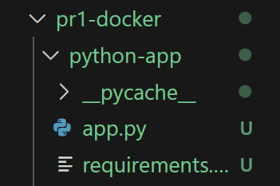
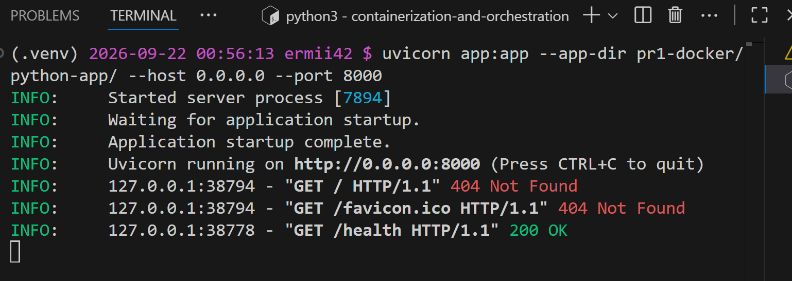
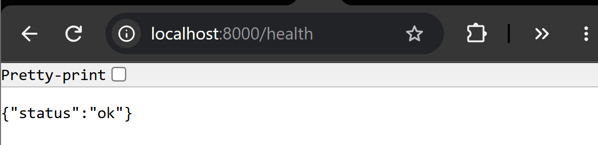
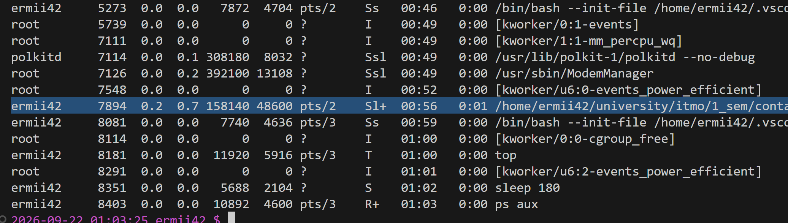

# Лабораторная работа 1 — Свой Docker
## Задача
В рамках лабораторной необходимо имитировать контейнеризацию

## Часть 0 — Свой сервис
Сгенерируем простенький сервис на Python со следующими эндпоинтами:

- GET /health — возвращает ok;
- GET /eat?mb=N — выделяет N мегабайт памяти и держит их;
- GET /burn — нагружает одно ядро CPU в бесконечном цикле

    

## Часть 1 — Запуск напрямую
Запустим сервис напрямую на устройстве через команду
```
uvicorn app:app --app-dir pr1-docker/python-app/ --host 0.0.0.0 --port 8000
```

Все работает корректно

Посмотрим процесс в ps на хосте

На данный момент изоляции нет, процесс видит всю систему

## Часть 2 — namespaces
А теперь поместим процесс в свои namespaces через unshare (pid, mount, net, uts, ipc и user).

Заходим внутрь процесса и видим, что:
- изнутри процесс — PID 1, чужих процессов не видит;

- у него своё имя хоста и своя пустая сеть;

- root внутри — это непривилегированный пользователь снаружи (проверь, под каким uid процесс виден на хосте).