# Лабораторная работа 1 — Свой Docker
## Задача
В рамках лабораторной необходимо имитировать контейнеризацию

## Часть 0 — Свой сервис
Сгенерируем простенький сервис на Python со следующими эндпоинтами:

- GET /health — возвращает ok;
- GET /eat?mb=N — выделяет N мегабайт памяти и держит их;
- GET /burn — нагружает одно ядро CPU в бесконечном цикле

    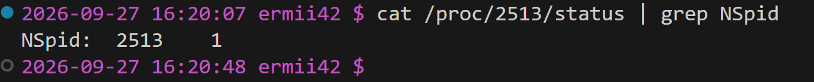

## Часть 1 — Запуск напрямую
Запустим сервис напрямую на устройстве через команду
```
uvicorn app:app --app-dir pr1-docker/python-app/ --host 0.0.0.0 --port 8000
```
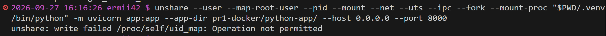
Все работает корректно
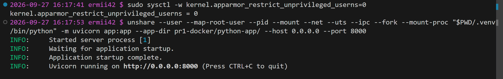
Посмотрим процесс в ps на хосте
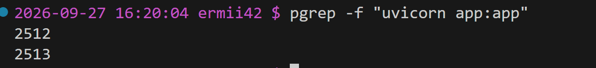
На данный момент изоляции нет, процесс видит всю систему

## Часть 2 — namespaces

А теперь поместим процесс в свои namespaces через unshare (pid, mount, net, uts, ipc и user).
Используем команду
```
unshare --user --map-root-user --pid --mount --net --uts --ipc --fork --mount-proc "$PWD/.venv/bin/python" -m uvicorn app:app --app-dir pr1-docker/python-app/ --host 0.0.0.0 --port 8000
```
иии.... Сталкиваемся с ошибкой
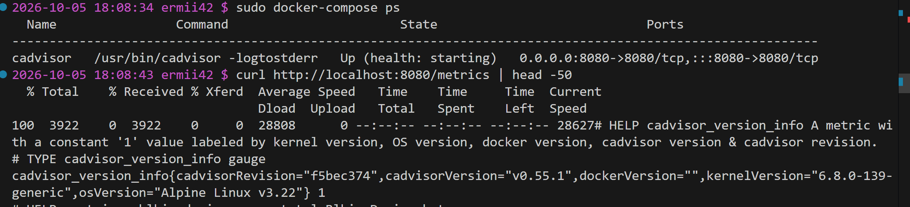

Все дело в том, что ядро Linux блокирует создание пользовательских пространств имен (user namespaces) для обычных пользователей. В современных дистрибутивах (особенно в Ubuntu 23.10+, 24.04+ и Debian 12+) это сделано в целях безопасности, чтобы предотвратить использование уязвимостей в ядре. Флаг --map-root-user пытается записать ваш UID в карту uid_map нового пространства имен, но ядро запрещает эту операцию.

Для Ubuntu 24.04 и новее можно разрешить создание user namespaces с помощью команды:
```
sudo sysctl -w kernel.apparmor_restrict_unprivileged_userns=0
```
Запускаем еще раз и все работает!
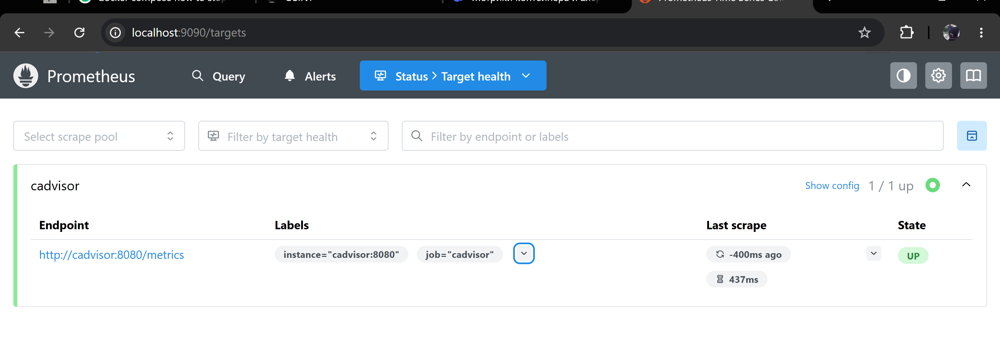

Находим процесс с помощью команды `pgrep -f "uvicorn app:app"`
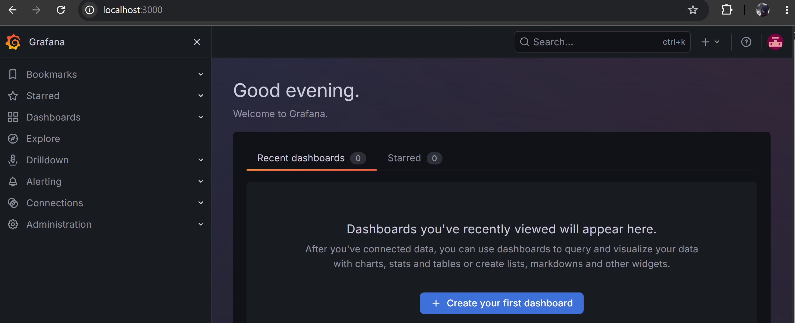

В Linux в файле /proc/<PID>/status есть поле NSpid. Оно показывает PID процесса во всех пространствах имен, вложенных друг в друга. Последнее число — это PID внутри самого внутреннего неймспейса.
`cat /proc/<PID>/status | grep NSpid`
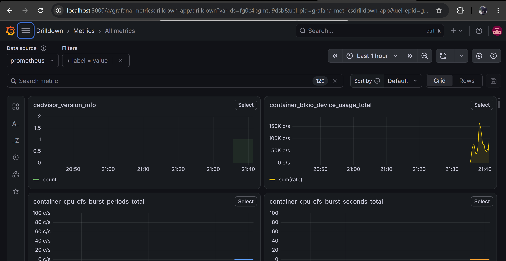
Заходим внутрь процесса 
```
sudo nsenter -t $PID -p -m -u -i -n -- /bin/bash
```
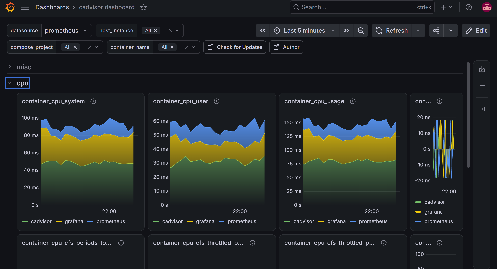
Флаги -p -m -u -i -n означают, что мы подключаемся к PID, Mount, User, IPC и NET namespace'ам целевого процесса

Видим, что:
- изнутри процесс — PID 1, чужих процессов не видит;
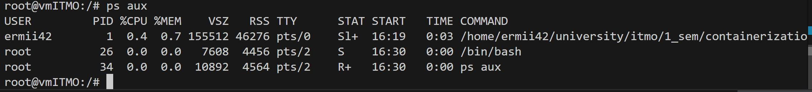
- у него своё имя хоста и своя пустая сеть;
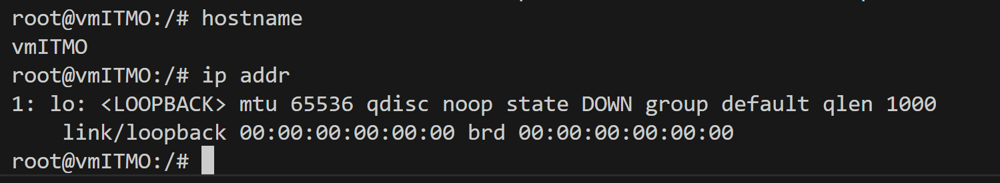
- root внутри — это непривилегированный пользователь снаружи (проверь, под каким uid процесс виден на хосте).
  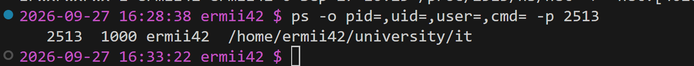

  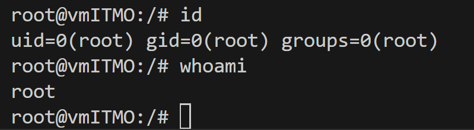
  
Что 
изолировал каждый namespace:

- **--user** — User Namespace (пользователи и группы)
    изолирует карту UID и GID. Позволяет процессу внутри иметь одни идентификаторы, а снаружи — совершенно другие.
- **--pid** — PID Namespace (идентификаторы процессов)
  изолирует таблицу процессов. Процессы внутри получают свои собственные PID, начиная с 1.
- **--mount** — Mount Namespace (файловая система) 
  изолирует таблицу монтирований. Каждое пространство имен имеет свою собственную иерархию смонтированных файловых систем
- **--net** — Network Namespace (сеть)
  изолирует сетевой стек полностью: интерфейсы, IP-адреса, таблицы маршрутизации, порты, iptables.
- **--uts** — UTS Namespace (имя хоста и домен)
  изолирует системные идентификаторы: hostname (имя хоста) и domainname (имя домена).
- **--ipc** — IPC Namespace (межпроцессное взаимодействие)
  изолирует механизмы System V IPC и POSIX message queues:

Дополнительные флаги:
- **--map-root-user** — shorthand для записи 0 <ваш_UID> 1 в /proc/self/uid_map. Работает только вместе с --user.
- **--fork** — заставляет unshare создать дочерний процесс. Без этого флага unshare выполнил бы команду в том же процессе, что невозможно для PID namespace (процесс не может стать PID 1 в новом неймспейсе, если он уже имеет PID на хосте).
- **--mount-proc** — convenience-флаг: создает новый mount namespace (если не создан) и монтирует в нем новый /proc, привязанный к текущему PID namespace.
  

## Часть 3 — cgroups
Заведем для процесса cgroup v2 и навесим лимиты. 
В cgroup v2 все контроллеры находятся в единой иерархии /sys/fs/cgroup/.
Создаем директорию для нашего cgroup
```
sudo mkdir -p /sys/fs/cgroup/myapp
```
Перемещаем процесс в этот cgroup
```
echo $PID | sudo tee /sys/fs/cgroup/myapp/cgroup.procs
```
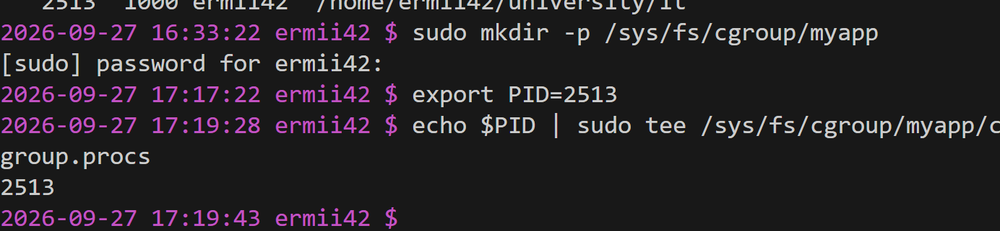
Проверяем, что процесс переместился
```
cat /proc/$PID/cgroup
```
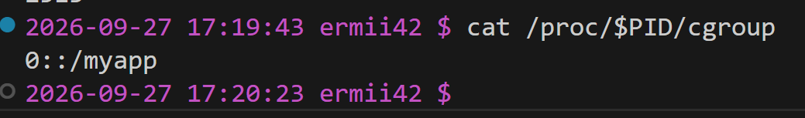

### Тест памяти: OOMKilled (как в Kubernetes)
Настраиваем лимит памяти

Устанавливаем лимит 100MB
```
echo 104857600 | sudo tee /sys/fs/cgroup/myapp/memory.max
```
Настроим сетевой мост, чтобы можно было достучаться до изолированного приложения. Нужно создать виртуальный кабель (veth), один конец которого будет в неймспейсе, а другой — на хосте.

Создаем пару виртуальных интерфейсов veth-host и veth-cont
```
sudo ip link add veth-host type veth peer name veth-cont
```
Перемещаем один конец в сетевой неймспейс процесса
```
sudo ip link set veth-cont netns $PID
```
Настраиваем IP-адреса и поднимаем интерфейсы
На хосте:
```
sudo ip addr add 192.168.100.1/24 dev veth-host
```
```
sudo ip link set veth-host up
```
Внутри неймспейса
```
ip addr add 192.168.100.2/24 dev veth-cont
```
```
ip link set veth-cont up
```
```
ip link set lo up
```
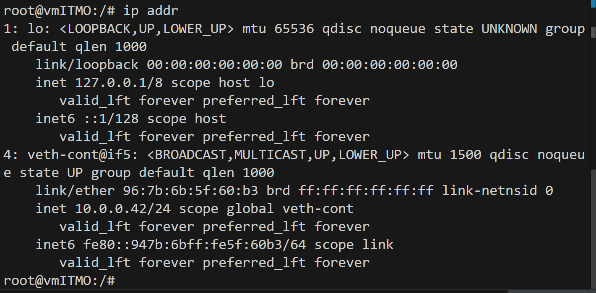

Теперь с хоста можно стучаться по новому IP, вызываем OOM через эндпоинт /eat, Пытаемся съесть 150MB (больше лимита)
```
curl http://192.168.100.2/eat?mb=150
```
На хосте
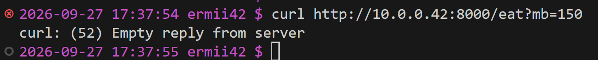
Внутри неймспейса
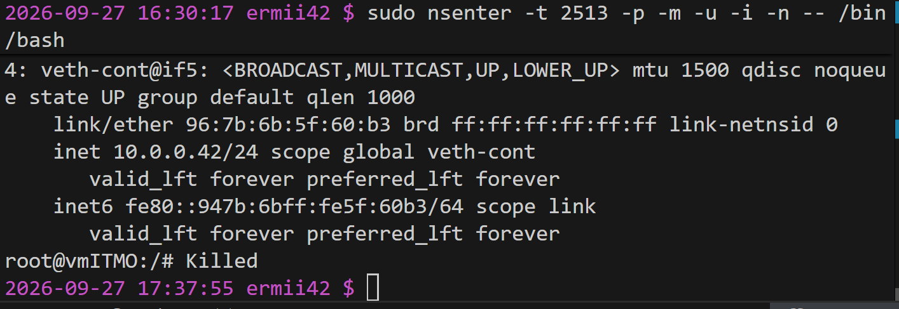

Смотрим статистику OOM
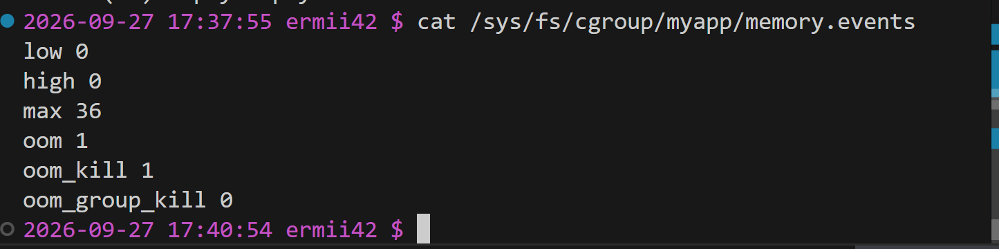
Что произошло:
Приложение попытается выделить 150MB памяти
Cgroup обнаружит превышение лимита (100MB)
Ядро убьет процесс через OOM killer
Вы получите ошибку соединения или процесс перезапустится


### Тест CPU: throttling (ограничение процессорного времени)

Настраиваем лимит CPU
```
echo "50000 100000" | sudo tee /sys/fs/cgroup/myapp2/cpu.max
```
Проверяем
```
cat /sys/fs/cgroup/myapp2/cpu.max
```
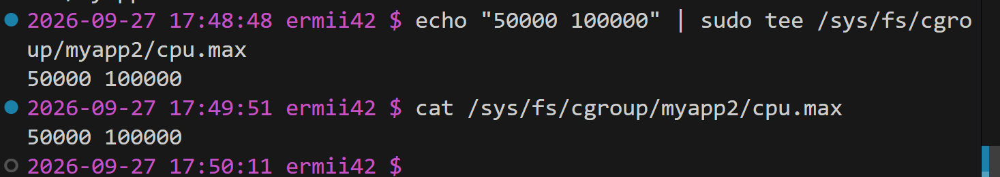

Вызываем загрузку CPU через эндпоинт /burn и ждем 5 секунд
```
curl http://10.0.0.42:8000/burn & sleep 5
```
Проверяем throttling в статистике
```
cat /sys/fs/cgroup/myapp2/cpu.stat
```
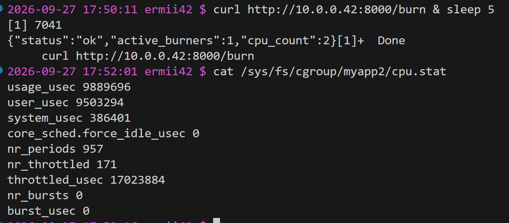
usage_usec 9889696      ← общее время CPU

nr_periods 957       ← количество периодов по 100ms

nr_throttled 171        ← количество раз, когда процесс был "задушен"

throttled_usec 17023884     ← общее время throttling


### Тест процессов: pids.max (защита от fork-бомбы)

Настраиваем лимит на количество процессов
```
echo 10 | sudo tee /sys/fs/cgroup/myapp2/pids.max
```
Проверяем
```
cat /sys/fs/cgroup/myapp2/pids.max
```
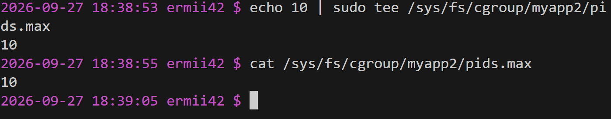
Смотрим текущее количество процессов
```
cat /sys/fs/cgroup/myapp2/pids.current
```
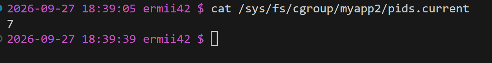
Запускаем fork-бомбу через stress-ng (внутри неймспейса)
```
stress-ng --fork 100 --timeout 5s &
```
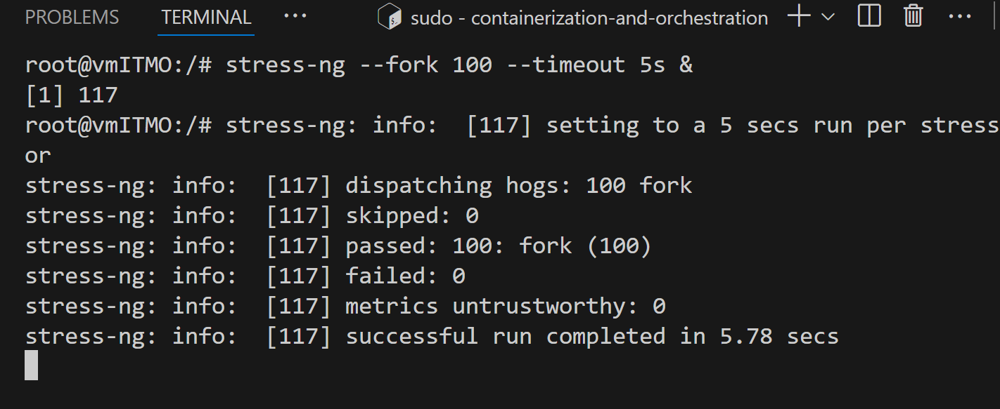
Проверяем статистику
```
cat /sys/fs/cgroup/myapp2/pids.current
```
Смотрим события 
```
cat /sys/fs/cgroup/myapp2/pids.events
```
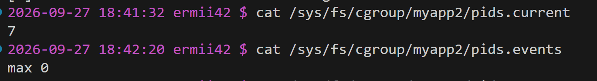
## Часть 4 — права
### Сброс лишних capabilities
Используем setpriv для сброса bounding set — это ограничивает набор capabilities, которые процесс может получить даже через execve.
```
unshare --user --map-root-user --pid --mount --net --uts --ipc --fork --mount-proc \
  setpriv --inh-caps=-all --bounding-set=-all --no-new-privs \
  "$PWD/.venv/bin/python" -m uvicorn app:app --app-dir pr1-docker/python-app/ --host 0.0.0.0 --port 8000
```
--inh-caps=-all — очищает inheritable set (набор, который может передаваться дальше).

--bounding-set=-all — удаляет capabilities из bounding set. Это критично: даже если процесс получит setuid-бинарник, он не сможет вернуть выброшенные capabilities.

--no-new-privs — запрещает любые попытки повышения привилегий через execve (игнорирует setuid/setgid-биты и file capabilities)

Проверка capabilities процесса:
```
grep -E "Cap(Eff|Prm|Bnd|Amb)" /proc/$PID/status
```
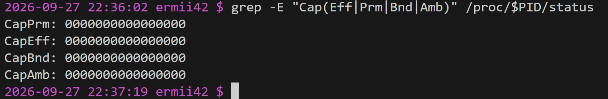

### Seccomp-профиль
Seccomp — это фильтр на уровне ядра, который перехватывает системные вызовы (syscalls). Даже если у процесса есть root-права и все мандаты, seccomp может запретить ему вызывать конкретные syscall'ы (например, reboot, mount, ptrace, mkdir). Это критически важно для предотвращения побега из контейнера (container escape).

Так как unshare не умеет загружать BPF-фильтры seccomp из CLI, мы сделаем это на уровне Python перед стартом Uvicorn.

Самый надежный и "чистый" способ применить seccomp в Python без установки специфических системных пакетов — использовать встроенный модуль ctypes для прямого вызова системной библиотеки libseccomp (она уже установлена в вашей системе, так как используется Docker, systemd и многими другими компонентами).

Напишем wrapper.py, небольшой Python-скрипт-обертку, которая применит seccomp-фильтр.
Также модифицируем скрипт для запуска
```
unshare --user --map-root-user --pid --mount --net --uts --ipc --fork --mount-proc \
  setpriv --inh-caps=-all --bounding-set=-all --no-new-privs \
  "$PWD/.venv/bin/python" "$PWD/pr1-docker/python-app/wrapper.py"
```
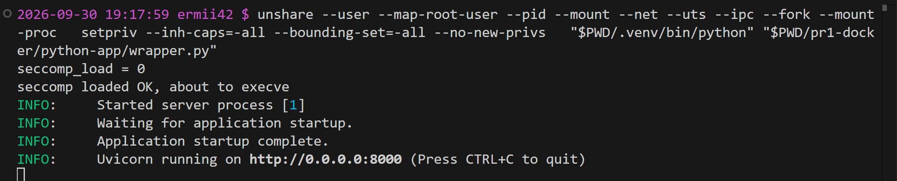

Фильтры корректно применились

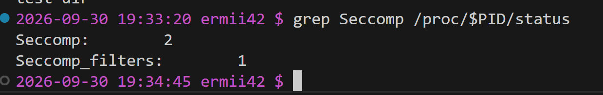

Проверим, выполняется ли mkdir
```
curl http://192.168.100.2:8000/test-mkdir
```
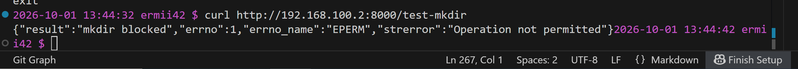

mkdir корректно заблокирован))

## Часть 5 — Собери свой Docker
Соберем все команды из частей 2–4 в один скрипт (mydocker.sh), который одной командой запускает api в своих namespaces, с cgroup-лимитами и урезанными правами.
Перед запуском скрипта дадим ему права на исполнение на хостовой машине
```
chmod +x pr1-docker/mydocker.sh
```
Запустим скрипт командой 
```
pr1-docker/mydocker.sh
```
Проверим, что сервис поднимается и /health отвечает.
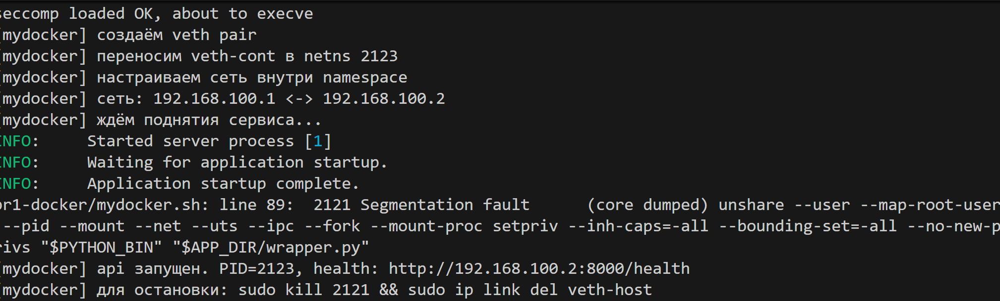
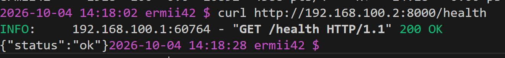

 Сравним, что совпадает, чего в скрипте нет и что Docker делает сверх него

|                             |                                                                     |                                                                                                 |
|-----------------------------|---------------------------------------------------------------------|-------------------------------------------------------------------------------------------------|
| Аспект                      | mydocker.sh                                                         | docker run                                                                                      |
| Изоляция namespace          | user, pid, mount, net, uts, ipc — вручную через unshare             | автоматически: все namespace, кроме cgroup (и user — опционально)                               |
| User namespace              | явно --map-root-user (root внутри = root снаружи)                   | по умолчанию не включён; root в контейнере = root на хосте, если не включён userns-remap        |
| cgroup CPU                  | cpu.max = 50000 100000 (0.5 CPU)                                    | --cpus="0.5" — эквивалентно                                                                     |
| cgroup PIDs                 | pids.max = 10                                                       | --pids-limit=10 — эквивалентно                                                                  |
| Capabilities                | setpriv --inh-caps=-all --bounding-set=-all — все capability убраны | по умолчанию оставляет ~14 capability (CHOWN, NET_BIND_SERVICE, SETUID и т.д.)                  |
| no-new-privs                | явно --no-new-privs                                                 | нужно указывать --security-opt=no-new-privs вручную                                             |
| Seccomp                     | вручную через обертку wrapper.py                                                     | Docker применяет default seccomp profile, блокирует ~44 syscall (ptrace, mount, reboot и т.д.)  |
| Сеть                        | вручную: veth pair, статические IP, nsenter                         | автоматически: bridge network, NAT, DNS                                                         |
| Файловая система            | не изолируется (mount namespace есть, но rootfs не меняется)        | изолированный rootfs из образа, pivot_root                                                      |
| Образ / rootfs              | используется хостовый rootfs                                        | отдельный rootfs из образа                                                                      |
| Управление жизненным циклом | вручную (kill, ip link del)                                         | docker stop/rm/start/restart, healthcheck, restart policy                                       |
| Логи                        | stdout/stderr процесса                                              | docker logs, драйверы логирования                                                               |
| Порты                       | вручную: veth + статические IP                                      | -p / --publish, DNAT                                                                            |
| Безопасность (по умолчанию) | сильнее: нет capabilities, есть no-new-privs                        | слабее по умолчанию: ~14 capability, root inside, нет no-new-privs                              |
| Удобство                    | низкое: ручное управление PID, cgroup, сетью                        | высокое: одна команда                                                                           |


## Часть 6 — Образы
Скрипту не хватало готовой файловой системы — её и даёт образ.

Напишем Dockerfile для api и соберем образ его и запустим с помощью команды.

```
sudo docker run -d \
  --name myapi-docker \
  --cpus="0.5" \
  --pids-limit=10 \
  -p 8000:8000 \
  my-python-app:latest
```
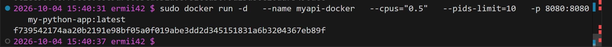

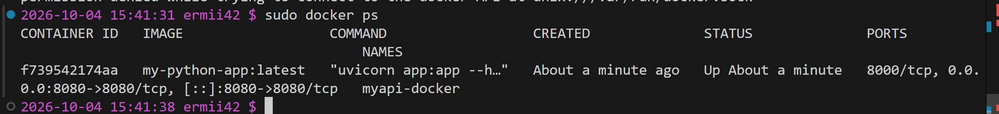

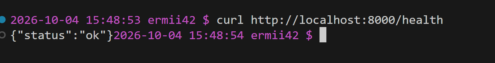

Сделем multi-stage-сборку с минимальной базой.
Сравним размер
```
sudo docker images --format 'table {{.Repository}}\t{{.Tag}}\t{{.Size}}' | grep my-python-app
```
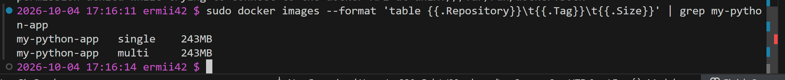

Число слоев
```
sudo docker image inspect my-python-app:single --format '{{len .RootFS.Layers}}'
sudo docker image inspect my-python-app:multi  --format '{{len .RootFS.Layers}}'
```
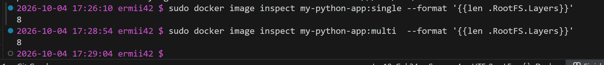

При пересборке приложения мы можем заметить, что
В single-сборке закешировалось
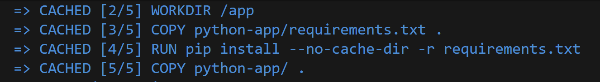
В multistage сборке закешировалось
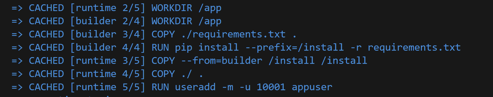

**Файл внутри контейнера: пропал после пересоздания**
Записываем файл в контейнер
```
sudo docker run -d --name myapi-test my-python-app:multi
sudo docker exec -u root myapi-test sh -c 'echo "hello" > /app/data.txt'
sudo docker exec myapi-test cat /app/data.txt
```
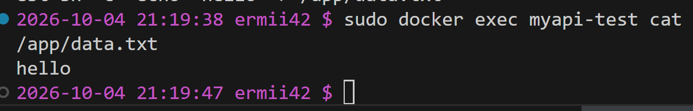
Удаляем и пересоздаём контейнер:
```
sudo docker rm -f myapi-test
sudo docker run -d --name myapi-test my-python-app:multi
sudo docker exec myapi-test cat /app/data.txt
```
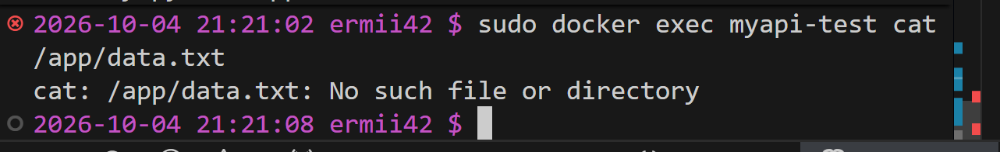

**Запускаем контейнер с томом**
Создаём том и монтируем его в /app:

```
sudo docker volume create myapi-data
sudo docker run -d --name myapi-test -v myapi-data:/app my-python-app:multi
```
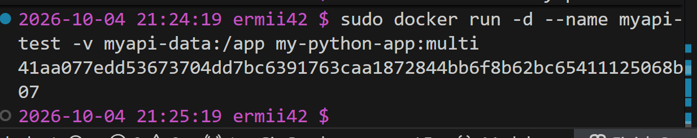

Записываем файл
```
sudo docker exec -u root myapi-test sh -c 'echo "hello" > /app/data.txt'
```
Удаляем и пересоздаём контейнер с тем же томом:
```
sudo docker rm -f myapi-test
sudo docker run -d --name myapi-test -v myapi-data:/app my-python-app:multi
sudo docker exec myapi-test cat /app/data.txt
```
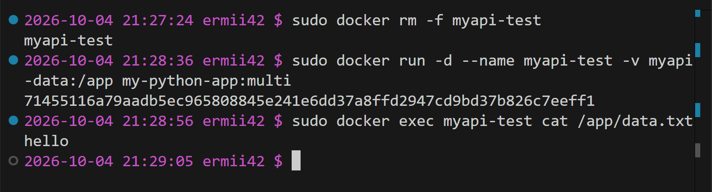
## Часть 7 — Когда контейнера мало
Запусти образ под gVisor (runsc) и сравни его изоляцию с обычным Docker и своим скриптом. Разберись, чем gVisor устроен иначе и почему его считают более изолированным. Отдельно ответь на вопрос: что у обычного контейнера остаётся общим с хостом в любом случае и почему это предел контейнерной изоляции. Выводы — в README.

## Часть 8 — Мониторинг
Сними метрики контейнера (память, CPU, throttling) из cgroup или через cAdvisor и собери дашборд. Реши сам, что важно видеть, и выбери 3 метрики под алерты — по каждой напиши, что она ловит и чем грозит.